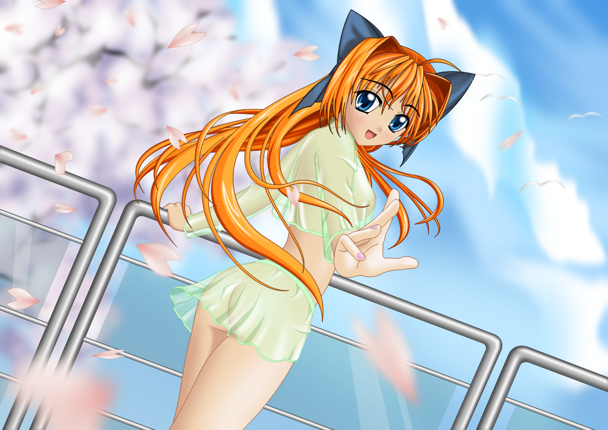
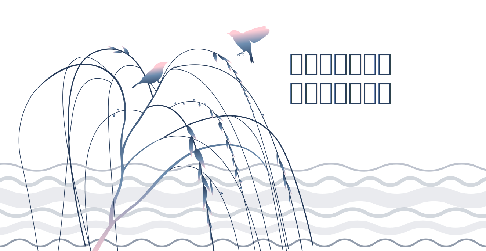
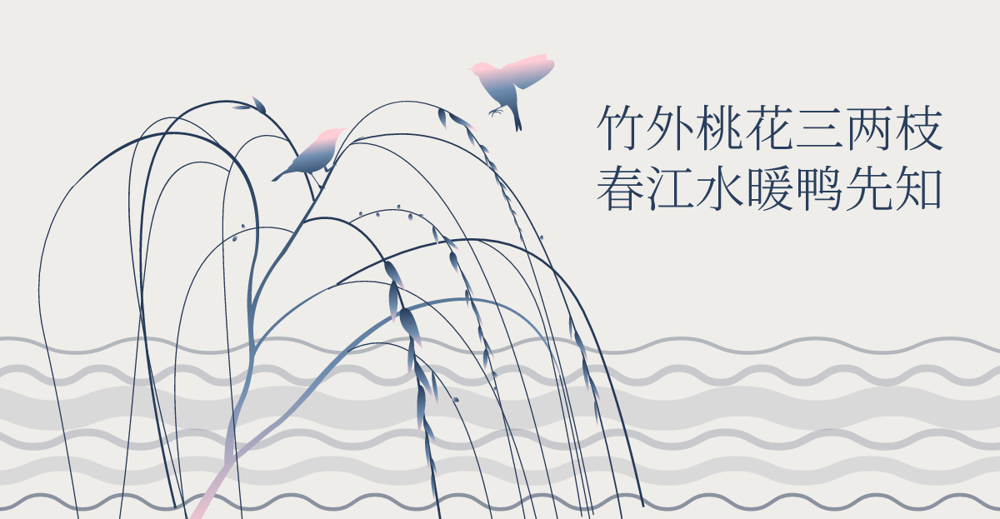

# resvg-js

<a href="https://github.com/yisibl/resvg-js/actions"></a>
<a href="https://www.npmjs.com/package/@resvg/resvg-js"></a>

> resvg-js is a high-performance SVG renderer, powered by Rust based [resvg](https://github.com/RazrFalcon/resvg/) and [napi-rs](https://github.com/napi-rs/napi-rs).

- Fast, safe and zero dependencies!
- No need for node-gyp and postinstall, the `.node` file has been compiled for you.
- Cross-platform support, including [Apple M1](https://www.apple.com/newsroom/2020/11/apple-unleashes-m1/).
- Support system fonts and custom fonts in SVG text.

## Installation

```shell
npm i @resvg/resvg-js
cnpm i @resvg/resvg-js
pnpm i @resvg/resvg-js
```

## [Example](example/index.js)

This example will load Source Han Serif, and then render the SVG to PNG.

```shell
node example/index.js

Loaded 1 font faces in 0ms.
Font './example/SourceHanSerifCN-Light-subset.ttf':0 found in 0.006ms.
✨ Done in 55.65491008758545 ms
```

| SVG                                                                 | PNG                                                                     |
| ------------------------------------------------------------------- | ----------------------------------------------------------------------- |
|  |  |
|                             |                             |

## Benchmark

```shell
Running "resize width" suite...
  resvg-js(Rust):
    12 ops/s, ±22.66%   | fastest 🚀

  sharp:
    9 ops/s, ±64.52%    | 25% slower

  skr-canvas(Rust):
    7 ops/s, ±3.72%    | 41.67% slower

  svg2img(canvg and node-canvas):
    6 ops/s, ±16.94%    | slowest, 50% slower
```

## Support matrix

|                  | node12 | node14 | node16 | npm                                                                                                                                                                     |
| ---------------- | ------ | ------ | ------ | ----------------------------------------------------------------------------------------------------------------------------------------------------------------------- |
| Windows x64      | ✓      | ✓      | ✓      | [](https://www.npmjs.com/package/@resvg/resvg-js-win32-x64-msvc)           |
|                  |
| Windows x32      | ✓      | ✓      | ✓      | [](https://www.npmjs.com/package/@resvg/resvg-js-win32-ia32-msvc)         |
|                  |
| Windows arm64    | ✓      | ✓      | ✓      | [](https://www.npmjs.com/package/@resvg/resvg-js-win32-arm64-msvc)       |
|                  |
| macOS x64        | ✓      | ✓      | ✓      | [](https://www.npmjs.com/package/@resvg/resvg-js-darwin-x64)                   |
|                  |
| macOS arm64(M1)  | ✓      | ✓      | ✓      | [](https://www.npmjs.com/package/@resvg/resvg-js-darwin-arm64)               |
|                  |
| Linux x64 gnu    | ✓      | ✓      | ✓      | [](https://www.npmjs.com/package/@resvg/resvg-js-linux-x64-gnu)             |
|                  |
| Linux x64 musl   | ✓      | ✓      | ✓      | [](https://www.npmjs.com/package/@resvg/resvg-js-linux-x64-musl)           |
|                  |
| Linux arm gnu    | ✓      | ✓      | ✓      | [](https://www.npmjs.com/package/@resvg/resvg-js-linux-arm-gnueabihf) |
|                  |
| Linux arm64 gnu  | ✓      | ✓      | ✓      | [](https://www.npmjs.com/package/@resvg/resvg-js-linux-arm64-gnu)         |
|                  |
| Linux arm64 musl | ✓      | ✓      | ✓      | [](https://www.npmjs.com/package/@resvg/resvg-js-linux-arm64-musl)       |
|                  |
| Android arm64    | ✓      | ✓      | ✓      | [](https://www.npmjs.com/package/@resvg/resvg-js-android-arm64)             |
|                  |
| Android armv7    | ✓      | ✓      | ✓      | [](https://www.npmjs.com/package/@resvg/resvg-js-android-arm-eabi)       |
|                  |

## Test in local

- Install latest `Rust`
- Install `Node.js@10+` which fully supported `Node-API`

```bash
npm i
npm build
npm test
```

## Roadmap & Contributing

I will consider implementing the following features, if you happen to be interested,
please feel free to discuss with me or submit a PR.

- [x] Support async API
- [x] Upgrade to napi-rs v2
- [ ] Support for getting SVG Bounding box
- [ ] Output usvg-simplified SVG string
- [ ] Support for generating more lossless bitmap formats, e.g. avif, webp, JPEG XL
- [ ] Support WebAssembly(.wasm)

## Release package

We use GitHub actions to automatically publish npm packages.

```
# 1.0.0 => 1.0.1
npm version patch

# or 1.0.0 => 1.1.0
npm version minor

git push --follow-tags
```

## License

[MPLv2.0](https://www.mozilla.org/en-US/MPL/)
